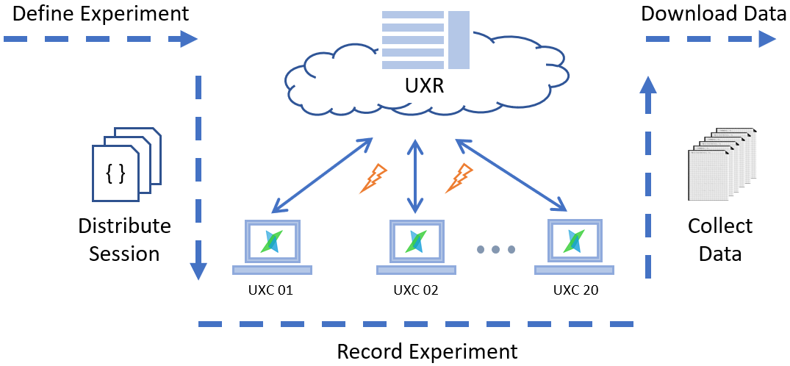

# UXR

[](https://dev.azure.com/uxifiit/UXR/_build/latest?definitionId=9&branchName=master) [](https://dev.azure.com/uxifiit/Packages/_packaging?_a=package&feed=990007cf-a847-406c-9fa5-dec22ee2ccdc&package=675fe609-a60a-41bf-bc50-7dfd3eba6e5a&preferRelease=true)

###### The web management application of the UXI Group Studies system.

UXR is designed for administration of group studies recorded with the [UXC client application](https://github.com/uxifiit/UXC).
UXC client and UXR web management applications form the UXI Group Studies infrastructure for conducting group eye tracking studies. 
This project is developed at [User eXperience and Interaction Research Center](https://www.uxi.sk/) of [Slovak University of Technology in Bratislava](http://fiit.stuba.sk/)

UXR is an ASP.NET MVC web application with one major component (area):
* *Studies* - administration of group studies - manage projects, sessions, recordings. 

## Main features

* Set up a new study project - create Project with an UXC session recording definition.
* Schedule sessions of the experiment, modify session definitions individually for each session if needed.
* Distribute session definition to UXC nodes.
* Remotely observe UXC nodes in the classroom on a dashboard.
* Control the UXC nodes in the classroom.
* Download recorded data after the recording.

<p></p>

## Solution structure

Source code folder `src` contains the following projects:

* UXR - the main app project.
* UXR.Common - helper classes.
* UXR.Models & UXR.Models.Entities - the main app EF Code First model including models of all the areas used in the app. 
* UXR.Studies - class library with `Studies` area for the main app, contains web Controllers for administration of group studies. 
* UXR.Studies.Api - WebApi controllers for `Studies` area.
* UXR.Studies.Api.Client - API client library, exposed as a NuGet package for other projects.
* UXR.Studies.Models - models for `Studies` area. 

When adding new functionality, consider if it belongs to the main app, `Studies` area, or a new area. 

## Contributing

Use [Issues](issues) to request features, report bugs, or discuss ideas.

## Dependencies

* ASP.NET MVC 5, WebApi, Owin
* [UXI.Libs](https://github.com/uxifiit/UXI.Libs)
* [Json.NET](https://github.com/JamesNK/Newtonsoft.Json)
* [Ninject](https://github.com/ninject/Ninject)
* [AutoMapper](https://github.com/AutoMapper/AutoMapper)
* Node.js
* and other through NPM 

## How to build


### Configure

Create these configuration files in the main UXR app project, based on the examples in `*.sample` files:
* `connectionStrings.config` - connection string for the database in the MSSQL Server.
* `deployment.config` - specify path where to store recordings and first user's (super admin) name and password.

### Bower bundles

For the UXR web app, NuGet was replaced with Bower for resolving JavaScript packages. See Developer notes on the Wiki pages for more information. 

These files were added to the default ASP.NET MVC 5 project template:
* **bower.json** - contains dependencies on JavaScript libraries.
* **.bowerrc** - contains location where to put downloaded libraries, set to **bower_components**.
* **gruntfile.js** - specifies grunt tasks.
* **package.json** - node.js configuration file.
* **App_Data/BowerBundles.json** - configuration file for Bower bundles._

Package restore is required before building, since the **bower_components** directory is set to be ignored by Git. 

To use Bower bundles with scripts and styles in Razor views, use:
* **@Html.HtmlCssCached("bundleName")** - equivalent to @Styles.Render("~/Content/bundleName")
* **@Html.HtmlScriptsCached("bundleName")** - equivalent to @Scripts.Render("~/bundles/bundleName")

### Restore and build Bower bundles

Bower bundles must be restored and built before running the app, either from command line or Visual Studio:

* From command line, run these commands to prepare publish package with **css, js, fonts** folders:

```
$ npm install -g bower
$ npm install -g grunt-cli

$ npm install
$ bower install --force-latest
$ grunt build
```

* In Visual Studio:
    1. Right click on the **package.json** file and `Restore Packages`.
    2. Right click on the **bower.json** file and `Restore Packages`.
    3. Open the **Task Runner Explorer** window in Visual Studio.
    4. Run the **build** task (double-click or right click and Run).
    5. Build task generates **css, js, fonts** folders. 


## NuGet packages

`UXR.Studies.Api.Client` library from this repository is available as a NuGet package in the public Azure DevOps artifacts repository for all UXIsk packages:

```
https://pkgs.dev.azure.com/uxifiit/Packages/_packaging/Public/nuget/v3/index.json
```

### Add UXIsk Packages to package sources
First, add a new package source. Choose the way that fits you the best:
* Add new package source in [Visual Studio settings](https://docs.microsoft.com/en-us/azure/devops/artifacts/nuget/consume?view=azure-devops).
* Add new package source from command line:
```
nuget source Add -Name "UXIsk Packages" -Source "https://pkgs.dev.azure.com/uxifiit/Packages/_packaging/Public/nuget/v3/index.json"
```
* Create or edit `NuGet.config` file in your project's solution directory where you specify this package source:
```
<?xml version="1.0" encoding="utf-8"?>
<configuration>
  <packageSources>
    <add key="UXIsk Packages" value="https://pkgs.dev.azure.com/uxifiit/Packages/_packaging/Public/nuget/v3/index.json" />
    <!-- other package sources -->
  </packageSources>
  <disabledPackageSources />
</configuration>
```

### Install packages

Use the Visual Studio "Manage NuGet Packages..." window or the Package Manager Console:
```
PM> Install-Package UXR.Studies.Api.Client
```


## Contributors

* Martin Konopka - [@martinkonopka](https://github.com/martinkonopka)
* Peter Demcak


## License

This project is licensed under the 3-Clause BSD License - see [LICENSE.txt](LICENSE.txt) for details.

Copyright (c) 2019 Faculty of Informatics and Information Technologies, Slovak University of Technology in Bratislava.


## Contacts

* UXIsk
  * User eXperience and Interaction Research Center
  * Faculty of Informatics and Information Technologies, Slovak University of Technology in Bratislava
  * Web: https://www.uxi.sk/
* Martin Konopka
  * E-mail: martin (underscore) konopka (at) stuba (dot) sk


## Publications

Bielikova, M., Konopka, M., Simko, J., Moro, R., Tvarozek, J., Hlavac, P., Kuric, E. (2018). Eye-tracking en masse: Group user studies,
lab infrastructure, and practices. *Journal of Eye Movement Research, 11(3)*, Article No. 6. DOI: http://dx.doi.org/10.16910/jemr.11.3.6
